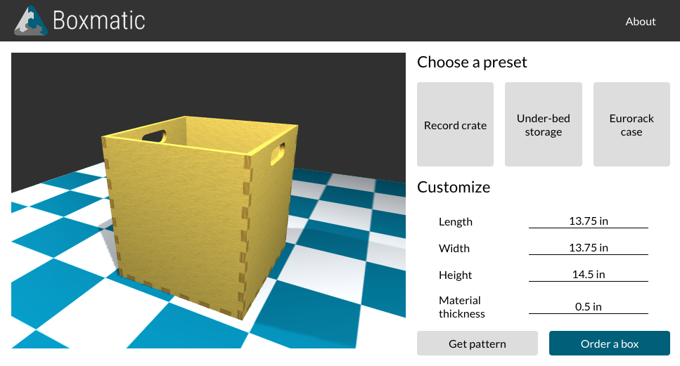

# Boxmatic

Boxmatic is a web app that generates patterns for enclosures that can be
fabricated using CNC tools. I made Boxmatic to experiment with interfaces for
visualizing and customizing physical products.

Live demo: <http://matt.meshul.am/boxmatic/>

